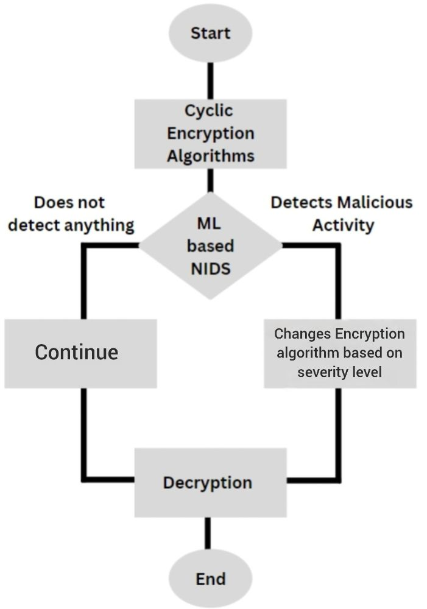

# Crypto-Agile NIDS

[](https://opensource.org/licenses/MIT)
[](https://www.python.org/downloads/)
[](https://scikit-learn.org/stable/)

> An ML-based Network Intrusion Detection System that dynamically enhances crypto-agility by rotating encryption algorithms based on real-time threats.

---

## System Architecture

This project implements a threat-responsive security system. Network traffic is first analyzed by a high-accuracy Machine Learning model. Based on the detected threat level, a control module selects the most appropriate cryptographic protocol, creating a dynamic and resilient security posture.



## Table of Contents

- [About The Project](#about-the-project)
- [Key Features](#key-features)
- [Repository Structure](#repository-structure)
- [Tech Stack](#tech-stack)
- [Dataset](#dataset)
- [Getting Started](#getting-started)
- [Usage](#usage)
- [Results](#results)
- [Author](#author)
- [License](#license)

## About The Project

In an evolving cybersecurity landscape, static cryptographic standards can become single points of failure. This project addresses this challenge by creating a **crypto-agile system** designed to automatically enhance security in response to detected network threats.

It utilizes a machine learning-based Network Intrusion Detection System (NIDS) to classify network traffic in real time. The classification output directly informs a control module, which then rotates between different encryption algorithms. This ensures the system is not just passively secure but **actively resilient**, always using the most appropriate level of security for the current threat environment.

## Key Features

* **Intrusion Detection:** Employs a finely-tuned `RandomForestClassifier` to identify and classify network threats with **96.42% accuracy**.
* **Dynamic Encryption:** A modular system that programmatically switches between different encryption protocols based on NIDS output.
* **Clean Architecture:** Core logic is encapsulated in the `cryptoagile_nids.py` script, while `main.ipynb` provides a clean demonstration. 

## Repository Structure

```
├── .gitignore              # Specifies intentionally untracked files to ignore
├── LICENSE                 # MIT License for the project
├── README.md               # Project documentation (this file)
├── assets                  # Folder for storing images and diagrams
│   └── system-architecture.png
├── cryptoagile_nids.py     # Core Python script with all classes and functions
├── data                    # Folder for housing the dataset files
│   ├── test.csv
│   └── train.csv
├── main.ipynb              # Jupyter Notebook for demonstration and analysis
└── requirements.txt        # Required packages for installation
```

## Tech Stack

* **Language:** Python
* **Machine Learning:** Scikit-learn
* **Data Manipulation:** Pandas, NumPy
* [cite_start]**Cryptography:** cryptography

## Dataset

This project utilizes the CICIDS2017 Dataset. It is a publicly available benchmark dataset for cyber secuirty research.

* **Source:** https://www.unb.ca/cic/datasets/ids-2017.html
* **Description:** The dataset contains labeled network flow records with 80+ features, representing both benign and malicious traffic (DoS, brute force, infiltration, etc.).

## Getting Started

To get a local copy up and running, follow these steps.

### Prerequisites

* Python 3.9+
* pip package manager

### Installation

1.  Clone the repository:
    ```sh
    git clone [https://github.com/Vaijayanthi-Sambath-Kumar/crypto-agile-nids.git](https://github.com/Vaijayanthi-Sambath-Kumar/crypto-agile-nids.git)
    cd crypto-agile-nids
    ```
2.  Install the required packages from `requirements.txt`:
    ```sh
    pip install -r requirements.txt
    ```

## Usage

The primary demonstration of this project is in the Jupyter Notebook.

1.  Launch Jupyter Notebook:
    ```sh
    jupyter notebook
    ```
2.  Open `main.ipynb` and run the cells sequentially to see a step-by-step execution of the system.  The notebook imports and utilizes the core logic from `cryptoagile_nids.py`. 

## Results

The core NIDS model was rigorously evaluated and demonstrated high performance in identifying threats.

* **Model Accuracy:** 96.42%

## Author

* **Vaijayanthi Sambath Kumar** - https://www.linkedin.com/in/vaijayanthi-sambath-kumar/

## License

This project is licensed under the MIT License. See the `LICENSE` file for more details.
